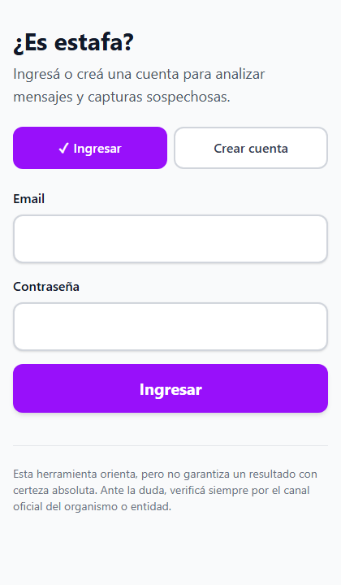
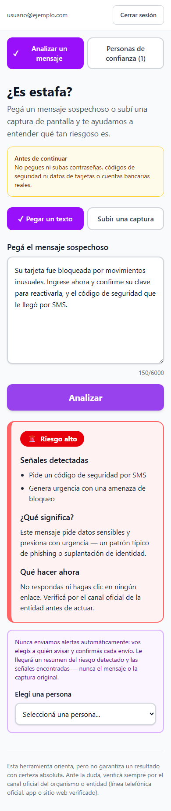
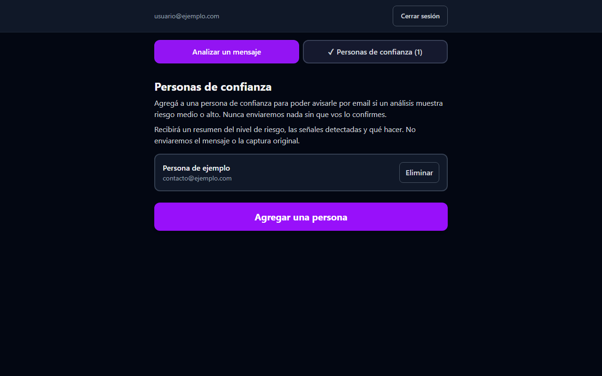

# ¿Es estafa?

Web app que ayuda a detectar mensajes, SMS, emails o llamadas fraudulentas en segundos.
Pegás el texto sospechoso (o subís una captura de pantalla) y un clasificador con IA
devuelve un veredicto claro — riesgo bajo, medio o alto — con las señales concretas
detectadas, una explicación en lenguaje simple y qué hacer al respecto. Si el riesgo es
medio o alto, podés avisarle por email a una persona de confianza con un solo click.

**Demo en vivo**: [codercup.vercel.app](https://codercup.vercel.app)

Pensado especialmente para adultos mayores y para quien los ayuda con la tecnología —
mobile-first, botones grandes, cero jerga técnica.

<p align="center">
  
  
  
</p>

## Cómo funciona

1. **Iniciás sesión** (email + contraseña, vía Supabase Auth).
2. **Pegás un mensaje sospechoso o subís una captura** de pantalla.
3. Google Gemini lo analiza y devuelve un **veredicto de riesgo** con señales concretas,
   una explicación simple y una acción recomendada.
4. Si el riesgo es **medio o alto**, podés elegir a una **persona de confianza** ya
   guardada y confirmar el envío de un email con el resumen del riesgo — nunca
   automático, siempre con tu confirmación explícita.

## Features

- **Clasificador de riesgo con IA** (texto o imagen vía OCR) — mismo motor y mismo
  contrato de datos para ambas fuentes, sin duplicar lógica.
- **Autenticación real** con Supabase Auth; cada usuario ve únicamente sus propios datos
  (Row Level Security en todas las tablas).
- **Gestión de personas de confianza** (alta, baja, sin límite) para poder avisarles por
  email cuando haga falta.
- **Alertas por email** vía Brevo, con idempotencia real (un mismo envío nunca se
  duplica), control de cuota diaria (por usuario y global) y manejo explícito de cada
  posible error (sesión vencida, límite alcanzado, envío en curso, etc.).
- **Accesibilidad de verdad**: navegación por teclado completa, `focus-visible` en todos
  los controles interactivos, objetivos táctiles ≥44×44px, distinción de riesgo por
  texto + ícono (no solo color, verificado con la interfaz en escala de grises),
  `prefers-reduced-motion` respetado en cualquier scroll o transición.
- **Responsive** desde 320px hasta escritorio, con modo claro y oscuro.
- **Cero foto/audio/texto guardado innecesariamente**: las imágenes nunca se persisten
  (solo el texto que se extrae de ellas), y los emails de alerta nunca incluyen el
  mensaje ni la captura original — solo un resumen del veredicto.

## Stack

| Capa | Tecnología |
|---|---|
| Frontend | React + TypeScript + Tailwind CSS, con Vite |
| Backend | Funciones serverless (Vercel) |
| Base de datos / Auth | [Supabase](https://supabase.com) (Postgres + Auth), con RLS en cada tabla |
| Clasificador de IA | [Google Gemini](https://aistudio.google.com) (tier gratuito, texto y visión) |
| Email transaccional | [Brevo](https://www.brevo.com) (tier gratuito) |
| Deploy | Vercel |

## Arquitectura

Todo input —texto pegado o una imagen ya pasada por OCR— se normaliza a un único
contrato antes de llegar al clasificador, que nunca sabe (ni necesita saber) de dónde
vino el contenido:

```
Texto pegado ──────────┐
                        ├─▶ { raw_text, source_type } ─▶ Clasificador (Gemini) ─▶ veredicto
Captura de pantalla ────┘        │                                                   │
   (OCR con Gemini Vision)       │                                                   ▼
                                  └─▶ persistido en Supabase (RLS) ──▶ "Avisar a una persona
                                                                        de confianza" (Brevo)
```

Ese mismo contrato de entrada ya contempla un tercer origen (`audio_transcript`) para
una futura transcripción de audio — el backend lo acepta, pero **no hay ningún control
de audio en la interfaz todavía**.

## Seguridad y privacidad

- Ninguna imagen se guarda en ningún lado — se procesa en memoria para esa única
  request y se descarta; solo el texto extraído por OCR persiste.
- Cada tabla de la base tiene Row Level Security activado: un usuario únicamente puede
  leer o escribir sus propios datos, verificado con clientes reales (no solo revisando
  las políticas).
- La `service_role key` de Supabase (privilegios de administrador) vive exclusivamente
  del lado del servidor, nunca en el bundle del navegador.
- El email de alerta nunca incluye el mensaje ni la imagen original — solo el nivel de
  riesgo, las señales detectadas, la explicación y la acción recomendada.
- Cuotas diarias de envío (por usuario y globales) para no agotar el plan gratuito del
  proveedor de email ni permitir abuso.
- Ninguna alerta se envía sin una confirmación explícita del usuario — nunca hay un
  envío automático.

## Correr el proyecto localmente

```bash
npm install
cp .env.example .env   # completar con tus propias credenciales (Gemini, Supabase, Brevo)
npx vercel dev          # levanta frontend + funciones serverless juntas
```

`npm run dev` también funciona si solo querés iterar sobre la interfaz (sin backend, el
análisis en sí no va a responder). Chequeos disponibles:

```bash
npm run build       # build de producción
npm run typecheck   # solo tipos
npm run lint         # oxlint
```

## Documentación técnica detallada

Este README es la puerta de entrada. El razonamiento completo de cada decisión —
esquema de base de datos, políticas de RLS, idempotencia de emails, protección contra
condiciones de carrera en el frontend, cuotas, accesibilidad, y las evaluaciones
reproducibles usadas para verificar cada pieza (`scripts/eval-*.mts`) — está documentado
en [`docs/ENGINEERING.md`](docs/ENGINEERING.md).

## Disclaimer

Esta herramienta orienta, pero no garantiza un resultado con certeza absoluta. Ante la
duda, verificá siempre por el canal oficial de la entidad u organismo correspondiente.
Nunca ingreses contraseñas, códigos de seguridad ni datos bancarios reales dentro de la
app.
